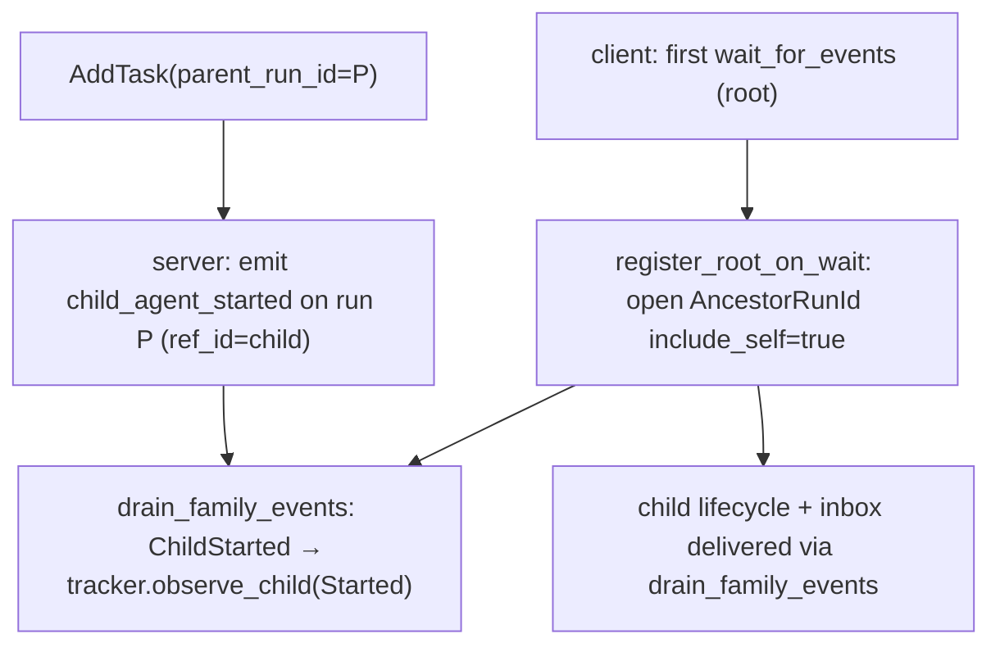
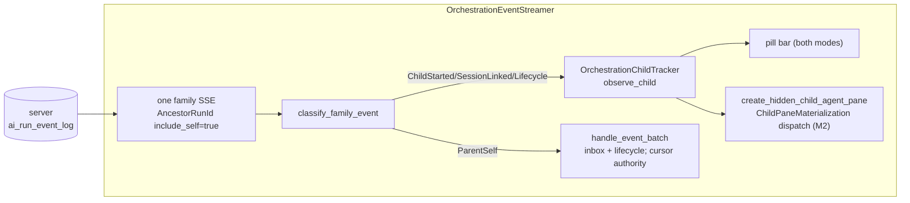
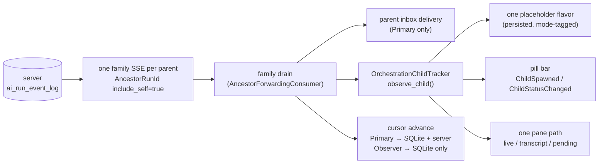
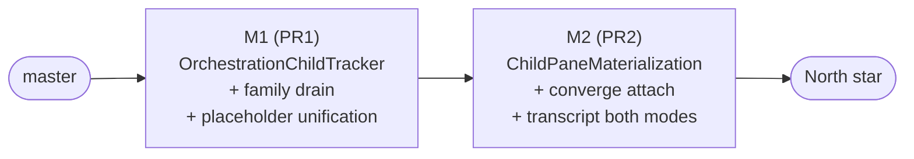

# TECH: Orchestration Child Tracking — Unified North-Star Implementation

Linear: QUALITY-928 — Emit a `child_agent_started` event so parents discover
children via push, and implement the full north-star orchestration tracking
architecture in a two-PR client stack.
Follow-up to QUALITY-919 (PR #13208), whose spec sketched this work under
"Always-on child discovery (lazy listening at first wait)".

## 1. Scope and status
This document is the single spec for orchestration child tracking. It covers:
- **M1 — Core tracker + unified stream** (branch `matthew/orch-unified-m1`,
  base `origin/master`): `OrchestrationChildTracker` as the sole entry point
  for child state; `classify_family_event` + `drain_family_events` replacing
  both separate drain pipelines; unified `is_remote_child` placeholder;
  `OrchestrationUnifiedStack` dogfood flag; rolled-out flag cleanup. §3
  specifies it.
- **M2 — Pane path + transcript** (branch `matthew/orch-unified-m2`, base M1
  branch): `ChildPaneMaterialization` unified dispatch; converged attach;
  transcript for both owner and viewer. §7.5 specifies the design.
- **Phases 1–3 of the earlier incremental roadmap are superseded**: the full
  north-star is implemented directly, avoiding ~600 lines of intermediate
  scaffold that would have been written and then deleted.

The server-side emits (S1–S5 + ACL propagation, §3.2) are in a separate
warp-server PR against `develop`; they are additive and safe to ship first.
Pinned research SHAs: warp-server `9eba7d0932`. No `warp-proto-apis` change
is needed: event types are Go string constants surfaced via `openapi.yaml`,
and the client deserializes generically into `AgentRunEvent`.

A reader should come away with: (a) a working mental model of how child
agents are discovered, represented, and shown in the north-star system;
(b) what M1 changes and why; and (c) the design decisions behind M2.

## 2. Background: concepts and vocabulary
- **Run / task**: a server-side agent run (`ai_tasks` row), identified by a
  `run_id` (stringified `AmbientAgentTaskId`). Client-side, an
  `AIConversation` may be linked to a run via `run_id`/`task_id`.
- **Parent / child**: a child run has `parent_run_id = P`. **One-level-tree
  invariant** (carried from QUALITY-919, load-bearing): a run is either a
  root orchestrator or a leaf child; the server ancestor query is
  single-level (`parent_run_id = $1`), consistent end-to-end. Revisit
  alongside the server query if multi-level trees are introduced.
- **Event consumer**: the *Primary* process hosts the orchestrator
  conversation (local root, or the cloud worker's driver), consumes the
  parent's inbox, and writes the authoritative server cursor. An *Observer*
  watches through a shared session, drops parent-self events, and persists
  only a local cursor. Authenticated task ownership never changes this role.
- **Pane origin**: `ChildPaneOrigin::{HostedConversation, SharedSession}`
  records the construction context for a child pane. Origin never grants
  live input or terminal continuation.
- **Task ownership**: `TaskOwnership::{Owned, NotOwned, Unknown}` is derived
  from the public run API's authoritative user/team `scope`. Exact creator
  equality is a compatibility fallback only when older payloads omit scope.
- **Conversation access**: `ConversationAccess::{Edit, ViewOnly, Unknown}`
  is derived from conversation object permissions. Terminal Edit access
  enables continuation; ViewOnly and Unknown remain passive.
- **Live role**: a child shared-session join's returned `Role` is the sole
  authority for live input. Task ownership and pane origin cannot promote a
  Reader or bypass a failed/inaccessible join.
- **Event log + SSE**: the server keeps an append-only `ai_run_event_log`
  with a monotonic global `sequence`, a publish path
  (`PublishLifecycleEvent` → `publishAgentRunEvent`), and an SSE handler
  with `RunIds([...])` and `AncestorRunId { ancestor_run_id, include_self }`
  filters whose ancestor query JOINs the children's `parent_run_id`
  (`include_self` adds the parent's own events). Children are created (any
  path: `run_agents`, Oz CLI, web API) through one funnel, `AddTask`.
  Relevant server code @ 9eba7d0932: `logic/ai/ambient_agents/add_task.go`
  (348-388, the child insert), `logic/agent_lifecycle.go` (13-81, event-type
  constants + `PublishLifecycleEvent`), `logic/agent_event_publish.go`
  (14-79, payload + PubSub), `model/ai_run_event_log.go` (35-120,
  `InsertEvent` + ancestor JOIN).
- **Cursor**: each consumer tracks the last fully-handled `sequence` and
  resumes SSE from it (`since=`). Primary-side it is per-conversation
  (`ConversationStreamState::event_cursor`), persisted to SQLite and pushed
  to the server; Observer-side it is per-orchestrator
  (`OrchestratorStreamState::event_cursor`), persisted to each viewer
  placeholder row but **not** pushed to the server.
- **Placeholder flavors**: a child that is not a local conversation is
  represented by a placeholder `AIConversation` in one of two flavors:
  - `is_remote_child` (hosted-conversation origin): **persisted** in
    `AgentConversationData` (`crates/persistence/src/model.rs:1196`), alongside
    `parent_conversation_id`, `parent_agent_id`, `run_id`, `agent_name`.
  - `is_viewing_shared_session` (shared-session origin): **runtime-only** —
    the flavor is a constructor argument (`AIConversation::new(true, ...)`) and is not
    written to `AgentConversationData`, so viewer children do not survive
    restart (§6, item 3).
  The current M2 implementation still uses this viewer flavor in
  `OrchestrationViewerModel`; the persisted single-flavor north star below
  has not fully replaced that path yet.
- **Owner-side child kinds.** Not every owner-side child is out-of-band:
  1. *Local in-band children* (`run_agents` local execution): real
     conversations running in this process with real hidden terminal panes —
     not placeholders. Each also holds its own child-role SSE
     (`RunIds([self])`) for its inbox.
  2. *Cloud in-band children* (`run_agents`/`start_agent` with cloud
     execution): started by this process. The `StartAgentExecutor` creates an
     `is_remote_child` placeholder up-front and stamps the run id via
     `assign_run_id_for_conversation` when the server responds.
  3. *Out-of-band cloud children* (Oz CLI, web API, another client):
     discovered only via `child_agent_started`/lifecycle events; the
     discovery path (§3.4) creates the same `is_remote_child` flavor.
  Kinds 2 and 3 converge on one representation and one hydration path — the
  discovery machinery only *creates* for kind 3, but refetch and pane
  hydration serve both. Kind 1 is deliberately different (§9.4).

## 3. M1 — Core Tracker + Unified Stream
**Behavioral contract.** Whenever a child task is created with
`parent_run_id = P` (by any method), a parent client watching `P` discovers
that child within one SSE round-trip — no polling — and surfaces its
subsequent lifecycle and inbox events. Children render as named child pills
with inbox messages attributed correctly. Clicking a child pill hydrates its
pane: live session join while running; transcript for both owner and viewer
once terminal (M2 implements the unified pane path).

### 3.1 Precondition: rolled-out flag cleanup
M1 deletes `FeatureFlag::OrchestrationViewerStreamer` and
`FeatureFlag::OwnerOrchestrationAncestorStreamer` (both already in the
`default` cargo set, i.e. on for all channels) along with the legacy viewer
REST polling path (`fetch_children` / `schedule_next_poll` / `maybe_kick_polling`
/ `apply_children_fetch`). The SSE-driven path is now unconditional on the
flag-off baseline.

### 3.2 Server: emit `child_agent_started` (separate warp-server PR)
**S1 — event-type constant.** In `logic/agent_lifecycle.go`, alongside the
existing `LifecycleEvent*` constants:
```go
const (
	LifecycleEventRunInProgress = "run_in_progress"
	// ... existing constants unchanged ...
	LifecycleEventRunCancelled  = "run_cancelled"

	// EventChildAgentStarted is emitted on a PARENT run when a child task is
	// created with parent_run_id = <parent>. The child run id is carried in
	// ref_id. This is a discovery signal, not a run status.
	EventChildAgentStarted = "child_agent_started"
)
```
**S2 — emit after the child is committed.** In `AddTask`
(`logic/ai/ambient_agents/add_task.go`) the child row is inserted inside
`database.TransactionWithNoResult(...)`. Add the emit *after* that block
returns successfully, next to the other post-commit side effects:
```go
// Notify the parent (if any) that a child was created so its client discovers
// the child via push instead of polling. Emitted on the PARENT run with the
// child run id in ref_id. Best-effort: a failure must not fail child creation.
// Placed after the commit because PublishLifecycleEvent both inserts and
// publishes and must not run inside the caller's transaction.
if params.ParentRunID != nil && *params.ParentRunID != "" {
	if _, err := logic.PublishLifecycleEvent(
		ctx,
		td.db,
		td.datastores,
		*params.ParentRunID,          // run_id the event is recorded on
		nil,                          // execution_id: the parent has none here
		logic.EventChildAgentStarted, // event_type
		&task.ID,                     // ref_id: the new child run id
	); err != nil {
		log.Warnf(ctx, "Failed to emit %s on parent %s for child %s: %v",
			logic.EventChildAgentStarted, *params.ParentRunID, task.ID, err)
	}
}
```
`PublishLifecycleEvent` inserts into `ai_run_event_log` (assigning the
monotonic `sequence`) and publishes to PubSub/SSE. Its
`resolveParentRunIDForPublish` looks up the *parent's own* parent for
routing metadata, which is `nil` under the one-level-tree invariant.

**S3 — document the type** in the events schemas in
`public_api/openapi.yaml`.

**S4 — tests.** In the `AddTask` suite, inject a mock via
`getEventPubSubClient` and assert: a task created with `ParentRunID` set
produces exactly one published event with `event_type=child_agent_started`,
`run_id=<parent>`, `ref_id=<child>`; a task with `ParentRunID` nil produces
none. Verify the event surfaces on both a `run_ids=[P]` stream and an
`ancestor_run_id=P&include_self=true` stream.

No schema/migration changes: the event lives on the parent run in the
existing log, so both filter shapes deliver it. **No server feature flag**:
the event is additive; old clients ignore unknown `event_type` values
(`lifecycle_event_type_from_wire` returns `None`; the cursor still advances
harmonlessly). Consumption is gated client-side.

**S5 — emit `run_session_linked` when a sandbox session links** (also in the
warp-server PR). In `updateSharedSessionLink`
(`logic/ai/ambient_agents/execution.go`), after the commit, best-effort emit
on the **child** run (session UUID in `ref_id`):
```go
if sharedSessionUUID != nil {
    if _, emitErr := logic.PublishLifecycleEvent(
        ctx, db, td.datastores,
        runID, nil, logic.EventRunSessionLinked, sharedSessionUUID,
    ); emitErr != nil {
        log.Warnf(ctx, "Failed to emit %s for run %s: %v",
            logic.EventRunSessionLinked, runID, emitErr)
    }
}
```
Old clients ignore this via the `_ => None` catch-all. The session UUID in
`ref_id` is consumed directly by M1: `classify_family_event` produces
`FamilyEvent::ChildSessionLinked { session_uuid }` and `observe_child` fills
in `session_id` without a metadata fetch. The event surfaces on the child's
run in both owner (`include_self=true`) and viewer (same stream, `ParentSelf`
drops) ancestor streams.

### 3.3 Client: OrchestrationUnifiedStack flag and stream opening
`FeatureFlag::OrchestrationUnifiedStack` (dogfood-only) gates the entire M1
system. Flag-off: behavior identical to the pre-M1 master baseline. Flag-on:
one `include_self: true` ancestor SSE per parent (`drain_family_events`), tracker
owns all child state.

`register_root_on_wait` is preserved: a root orchestrator registers for the
family stream at its first `wait_for_events` when the flag is on, before any
child exists. `WaitForEventsParentRegistration` continues to guard this
mechanism on the flag-off baseline and is superseded (not deleted) in M1.

On the flag-on path, both owner and viewer open a single `include_self: true`
ancestor SSE. The viewer drops `ParentSelf` events (no inbox). Owner and
viewer each hold one `OrchestrationChildTracker` — the streamer hosts it in
`ConversationStreamState` (owner) and `OrchestratorStreamState` (viewer).

`register_root_on_wait` (flag-on path):
```rust
pub fn register_root_on_wait(&mut self, conversation_id: AIConversationId, ctx: ...) {
    if !FeatureFlag::WaitForEventsParentRegistration.is_enabled() { return; }
    // guards: not a child (one-level tree), not a passive remote-run view,
    // has a self_run_id ...
    let stream = self.streams.entry(conversation_id).or_default();
    if stream.ancestor_on_wait { return; }
    stream.ancestor_on_wait = true;
    stream.watched_run_ids.insert(self_run_id);
    self.reevaluate_eligibility(conversation_id, ctx);
}
```
`is_eligible` treats a wait-registered root (`ancestor_on_wait`) as having
an orchestration role, and `desired_sse_filter` selects
`AncestorRunId { ancestor_run_id: self_run_id, include_self: true }` — one
connection carrying the parent's own inbox (`new_message`), child lifecycle
events, and `child_agent_started`. The call site is
`wait_for_events.rs::execute`. The method does **no network fetch**
(replacing QUALITY-919's per-wait `get_ambient_agent_task`).

**Design decision — open the superset stream up front.** The QUALITY-919
follow-up sketched opening a cheap `RunIds([self])` stream and *upgrading*
to the ancestor filter on the first `child_agent_started`. That introduces a
cursor-handoff gap: the per-conversation `event_cursor` is a single scalar
over the *global* sequence space, but a self stream only delivers run-`P`
events, so a parent-self event can advance the cursor past a lower-sequenced
child event the narrow filter never delivered; the ancestor reconnect then
resumes from the advanced cursor and skips it. Opening the ancestor
(superset) stream from the start means the filter never widens, so the
cursor always covers the full watched set. The cost — a childless waiting
root holds a JOIN stream rather than a run-ids stream — is one idle SSE
either way. Consequence: `child_agent_started` is a discovery-latency
optimization, not a correctness-critical upgrade trigger; a child created
during an already-blocked wait before the stream opens is caught by replay
from the cursor when it connects (self-healing).

**Gating.** `OrchestrationUnifiedStack` gates the whole system. Off ⇒
behavior identical to master: roots discovered only via `run_agents`/restore,
`drain_family_events` never called, `observe_child` never called. Gating the
consumption is necessary because a `run_agents`/restore parent holds an open
ancestor stream even with the flag off; without consumption gates the new
machinery would ship ungated to production the moment the server starts emitting.

**`WaitForEventsParentRegistration`** remains as a secondary gate on the
`register_root_on_wait` call site (flag-off baseline), superseded when
`OrchestrationUnifiedStack` is on. Safe to promote/remove separately.

**None-handling.** When a parent or wait-root has no `self_run_id` yet,
`desired_sse_filter` returns `NoFilter` (with a warn) and defers until
`on_server_token_assigned` re-evaluates. Safe in practice because the run id
arrives via StreamInit / task creation before the model can emit any tool call.

### 3.4 Client: OrchestrationChildTracker and observe_child
All child state changes on both owner and viewer funnel through
`OrchestrationChildTracker::observe_child` (see §7.2 for the full design
and `ChildSignal` variant list). The four-step logic:

0. Drop tombstoned runs and runs owned by a non-placeholder local conversation.
1. Create-or-update child membership, then converge the fetched task metadata
   through `BlocklistAIHistoryModel::ensure_remote_child_conversation`
   (`is_remote_child = true`, both modes).
2. Write status through on `Lifecycle` signals and emit the shared status event.
3. Refetch metadata via the shared task cache while
   `session_id` is missing or pane not materialized.
4. Request pane materialization once `session_id` is known, or transcript once terminal.

`ChildSignal::SessionLinked { session_uuid }` is handled directly from
`run_session_linked` events: the session UUID is extracted from `ref_id`
and fills in `session_id` without a metadata fetch, then pane materialization
is requested immediately. This eliminates the metadata-fetch round-trip
for the attach-time window.

`ChildSignal::Started` (from `child_agent_started`) is idempotent:
calling it again for the same run id is a no-op (explicit tracker state
replaces the old `conversation_id_for_agent_id(...).is_none()` implicit guard).
An unknown `ChildSignal::Lifecycle` performs the same eager membership insert
and emits `ChildSpawned` before the metadata fetch, so lifecycle-before-started
is a complete discovery backstop rather than a tracker-only fetch.
`ChildSignal::Registered` (from `StartAgentExecutor`) prevents placeholder
creation for in-band children — tracker marks them as already-represented.
Tombstoned runs are checked at step 0 so kills mid-fetch cannot resurrect placeholders.



### 3.5 M1 drain: drain_family_events and classify_family_event
`drain_family_events` replaces both `drain_sse_events` (owner) and
`drain_ancestor_events` (viewer). Events are classified by
`classify_family_event(event, self_run_id)` into `FamilyEvent` variants
(see §7.3 for the full sketch):

- **`ChildStarted`** → start/dedupe real task metadata hydration and
  `tracker.observe_child(Started)`
- **`ChildSessionLinked`** → `tracker.observe_child(SessionLinked { session_uuid })`
  (extracts UUID from `ref_id`; no metadata fetch needed)
- **`ChildLifecycle`** → the same metadata backstop plus
  `tracker.observe_child(Lifecycle(kind))`
- **`ParentSelf`** → Primary: `handle_event_batch` (inbox + lifecycle);
  Observer: dropped (no parent-self delivery)
- **`Opaque`** → cursor advances only (forward compat)

Cursor authority: Primary calls `persist_cursor_local_and_server`; Observer
calls `persist_cursor_local_only`. `refresh_task_data` coalesces in-flight
fetches: a refetch arriving mid-fetch is recorded and one follow-up issues
on completion.

### 3.6 M1 validation
`cargo nextest run -p warp --no-fail-fast`, `./script/format`, and clippy
(`-D warnings`) all pass.
- Flag OFF: all pre-M1 tests pass; `OrchestrationEventStreamer` keeps the two
  drain paths; viewer children NOT persisted. Behavior identical to master.
- Flag ON: `drain_family_events` is the sole drain; `observe_child` is the
  sole entry point for child state; viewer children persisted as
  `is_remote_child = true`.
- `observe_child` idempotency: two `Started` signals for the same run id
  issue exactly one metadata fetch.
- Tombstoned-run skip: `observe_child(Lifecycle)` for a killed run id is a no-op.
- `Registered` prevents placeholder creation for in-band children.
- `SessionLinked { session_uuid }` fills in `session_id` without a fetch.
- `classify_family_event`: all five variants covered by unit tests.
- Cursor authority: flag-ON + Observer → cursor advance does NOT push to server.
- Rolled-out flags deleted; legacy REST polling path absent.

Manual (dogfood, `OrchestrationUnifiedStack` on, server PR deployed): create
a child via Oz CLI/web API with `parent_run_id`, have the parent
`wait_for_events`; verify the child surfaces without polling latency as a
named pill with attributed messages. Click a child pill at three lifecycle
moments (early/Queued, running, completed) and verify re-drive → live join →
transcript respectively (§4.5 empirical contract).

## 4. North-star architecture
### 4.1 At a glance


One SSE per parent family; `OrchestrationEventStreamer` hosts both Primary and
Observer tracker instances. The streamer's state maps (`streams` for Primary,
`viewer_mode_orchestrators` for Observer, retaining its legacy field name)
each carry an `OrchestrationChildTracker`. The tracker is the sole entry point
for child state changes; `OrchestrationViewerModel` and the Primary drain both
delegate to it.

### 4.2 Delivery path
`handle_event_batch` is called for `ParentSelf` events by Primary only.
It advances and persists the cursor (SQLite + server for Primary, SQLite-only
for Observer), drops killed-run events, and enqueues inbox messages and
lifecycle items into `OrchestrationEventService` for the parent's LLM
input path (`drain_and_convert_events`). The tracker, not `handle_event_batch`,
writes child `ConversationStatus` — this fixes the owner-side pill-staleness
gap (§6, item 3) where status lagged until pane attach.

### 4.3 Pane path (M2)
See §7.5. `ChildPaneMaterialization` with three variants:
- **`AttachLive { session_id }`**: `attach_child_session` using the pane
  origin's construction path. The joined shared-session `Role`, not origin or
  task ownership, controls live input.
- **`LoadTranscript { server_token }`**: fetch transcript and permissions.
  Explicit `ConversationAccess::Edit` uses the continuation-capable ambient
  presentation when the task source permits cloud follow-ups; blocked sources,
  `ViewOnly`, and `Unknown` use the passive read-only transcript.
  When permissions metadata is unavailable, authoritative
  `TaskOwnership::Owned` is the compatibility fallback; it cannot override
  explicit ViewOnly.
- **`Pending`**: tracker re-drives when state changes via `observe_child`.

`ChildPaneOrigin::{HostedConversation, SharedSession}` is orthogonal to this
state decision and to capabilities.

### 4.4 Empirical grounding (three click-timing cases)
Validated against a healthy session-sharing server:
- **Early click (Queued/Pending)**: child not attachable for ~10s; pane
  re-drives as the task advances. `run_session_linked` fires at sandbox claim;
  `SessionLinked` signal fills in `session_id` directly without a metadata fetch.
- **Running click**: single immediate `AttachLive`.
- **Completed click**: single terminal `LoadTranscript` (owner and viewer).

## 5. Differences that drove the unified design
*These were the gaps in the pre-M1 baseline; all are closed by M1 + M2.*

1. **Consumer gating.** OVM registered only in the viewer context; the owner
   drain maintained separate helpers. M1: both delegate to `observe_child`.
2. **Placeholder flavor.** `is_remote_child` (owner, persisted) vs
   `is_viewing_shared_session` (viewer, runtime-only). M1: unified to
   `is_remote_child = true` for all child placeholders, fixing the viewer
   restore-after-restart bug.
3. **Broadcast events were viewer-only.** `ChildSpawned`/`ChildStatusChanged`
   emitted only by `drain_ancestor_events`; owner drain fed `handle_event_batch`
   directly (no status writes). M1: tracker emits them for both modes and is
   the sole status writer.
4. **Two ancestor SSEs with different wire filters and cursor authority.**
   M1: one `include_self: true` family SSE; viewer drops `ParentSelf` events;
   cursor authority dispatched by mode inside `drain_family_events`.
5. **Pane materialization differed.** Owner had `LoadTranscript`; viewer
   dead-ended at loading state for completed children. M2: `ChildPaneMaterialization`
   with `LoadTranscript` for both modes.

## 6. Why unify (the value)
1. **Duplication and drift.** Six near-identical concerns implemented
   twice, in one file plus two pane paths. Each fix must be discovered and
   applied twice. Historical evidence: the pre-M1 owner side had to re-grow
   refetch, self-heal, and placeholder logic that OVM already had.
2. **Two ancestor SSE connections per parent** when an owner and a viewer run
   in the same process family (and always two server-side query shapes to
   maintain). One JOIN-backed stream per parent family is strictly cheaper
   and removes a whole class of "which stream saw it first" reasoning.
3. **Capability gaps are side-of-origin accidents, not decisions.**
   - The **restore-after-restart bug**: a `/cloud-agent` shared-session parent
     restores without its children — no pills, children render as "Unknown
     agent" — because viewer placeholders are runtime-only (§2) and OVM's
     registration precondition isn't re-established on restore. The owner
     flavor survives restart; the viewer flavor does not.
   - The **terminal-transcript gap**: clicking a finished child works
     owner-side (`LoadTranscript`) but dead-ends viewer-side (loading
     placeholder forever), because only one stack grew the branch.
   - The **owner-side pill-staleness gap**: owner-side cloud-child
     placeholders had no event-driven status writer (lifecycle events were
     consumed as LLM inputs, not status writes). M1 fix: tracker is sole
     status writer for both modes.
4. **Bespoke machinery outlives its cause.** The pending/settle re-drive
   (`pending_remote_child_hydrations`, `settles()`) existed because the owner
   pane path could be entered before task data was complete. M2 fix: tracker
   re-drives `Pending` children from `observe_child`; no bespoke machinery.
5. **Reviewability.** `orchestration_event_streamer.rs` is ~2600 lines
   hosting two parallel pipelines with different key types, cursor rules,
   and event contracts. Collapsing them is the single biggest lever on
   comprehension and future orchestration work (e.g. multi-level trees would
   today need to be implemented twice).

## 7. North star architecture
### 7.1 Overview
One of each mechanism:
- **One discovery signal**: `child_agent_started` (creation-time) plus child
  lifecycle events as the self-healing backstop, consumed identically for
  owner and viewer.
- **One ancestor stream per parent family**: a single
  `AncestorRunId { include_self: true }` SSE whose drain fans out by event
  kind — parent inbox to the owner's inbox consumer, discovery/lifecycle to
  the child tracker — while respecting cursor authority. This is the
  `AncestorForwardingConsumer` generalization the code already anticipates.
- **One child tracker**: an `OrchestrationChildTracker` owning discovery,
  claim-time refetch, placeholder creation, and materialization requests for
  both Primary and Observer consumers.
- **One placeholder flavor**: a single persisted conversation kind with a
  mode tag, fixing the viewer restore bug by construction.
- **One pane path**: a state-only materialization function with live-session,
  terminal-transcript, and pending branches, followed by independent origin
  and access presentation decisions.
- **Refresh**: event-driven with a bounded fallback (already true after
  Phase 0 on both sides).



### 7.2 `OrchestrationChildTracker` (sketch)
Extract OVM's core into a model keyed on the orchestrator, running in both
modes. The mode captures the only real behavioral differences:
```rust
/// Family-event consumption role (not authenticated ownership / permissions).
enum OrchestrationEventConsumer {
    /// Primary family-event consumer: deliver parent-self events and
    /// persist local + authoritative server cursor.
    Primary { orchestrator_conversation_id: AIConversationId },
    /// Observer family-event consumer: drop parent-self events; persist
    /// local cursor only (never push server cursor).
    Observer { placeholder_conversation_id: AIConversationId },
}

struct TrackedChild {
    conversation_id: AIConversationId,   // the unified placeholder
    session_id: Option<SessionId>,       // None until claim time
    last_state: AmbientAgentTaskState,
    pane_materialized: bool,
}

pub struct OrchestrationChildTracker {
    parent_task_id: AmbientAgentTaskId,
    mode: OrchestrationEventConsumer,
    children: HashMap<AmbientAgentTaskId, TrackedChild>,
    children_by_run_id: HashMap<String, AmbientAgentTaskId>,
    /// In-flight metadata fetches (today's `remote_child_placeholder_fetches`
    /// and OVM's dispatch guard, unified).
    metadata_fetches: HashSet<String>,
}

/// Every way a child can become known funnels into one entry point.
enum ChildSignal {
    Started,                                  // child_agent_started (ref_id)
    Lifecycle(api::LifecycleEventType),       // any recognised lifecycle event
    Seeded(AmbientAgentTask),                 // REST seed / restore fetch row
    /// Created by this process (run_agents / start_agent): the executor
    /// registers the child it just made, with its existing conversation.
    Registered { conversation_id: AIConversationId },
}

impl OrchestrationChildTracker {
    fn observe_child(&mut self, child_run_id: &str, signal: ChildSignal, ctx: ...) {
        // 0. drop tombstoned (locally killed) runs, and runs owned by a
        //    non-placeholder local conversation (local in-band children)
        // 1. ensure placeholder exists (create-or-update; self-healing by
        //    construction since every signal funnels here)
        // 2. write status through on lifecycle signals (sole writer, §7.3)
        // 3. refetch metadata while session_id is missing or pane not
        //    materialized (claim-time wait)
        // 4. request pane materialization once session_id is known, or a
        //    transcript view once terminal (§7.5)
    }
}
```
This subsumes, on the owner side: `register_children_from_events`'s
placeholder work,
`ensure_remote_child_placeholder`/`finish_remote_child_placeholder`,
`ensure_placeholders_for_child_lifecycle_events`, and
`trigger_child_task_refreshes`; on the viewer side: `handle_child_spawned`,
`handle_child_status_changed`, `spawn_task_metadata_fetch`, `register_child`.

**Child membership has one writer.** The streamer keeps only wire concerns.
Under the family (ancestor) filter the wire shape needs just the parent's
`self_run_id` (`desired_sse_filter`'s ancestor branch already uses nothing
else), so per-child run-id sets stop being filter inputs: child membership
lives in the tracker alone, and the streamer's parent-role check and
`RunIds`-fallback derivation read tracker state instead of maintaining
`watched_run_ids` copies. `watched_run_ids` shrinks to self-inbox watching
for the legacy fallback. This avoids re-creating the dual-source-of-truth
problem §7.6's fifth item warns about.

In-band children flow through the same funnel: the `StartAgentExecutor`
registers each child it spawns (`ChildSignal::Registered`), so later
`Started`/`Lifecycle` signals for that run id are idempotent status updates
rather than placeholder creation — replacing today's implicit
`conversation_id_for_agent_id(...).is_none()` guards with explicit tracker
state. Local in-process children are observed for status only and never get
placeholders or metadata fetches (§9.4). All tracker metadata fetches route
through `AgentConversationsModel`, not raw client calls (§7.6, item 1).

**Cardinality, mode resolution, and lifetime.** One tracker per
`parent_task_id` per process, hosted in a singleton registry with refcounted
consumers — exactly the shape of today's `viewer_mode_orchestrators` entries.
OVM and the owner's agent view become thin per-pane consumers that register
and unregister. Mode is *derived*, not configured: `Primary` when this process is the
family-event primary (delivers parent-self + server cursor); `Observer`
otherwise. A second local pane on the same family registers as another
consumer of the existing tracker rather than creating a second tracker.
Primary trackers live as long as the orchestrator conversation; Observer
trackers tear down when the last consumer unregisters (today's refcounting
rule). This type describes family-event consumption and cursor
responsibility only — not authenticated ownership, permissions, or pane
capability.

### 7.3 One family stream per parent (sketch)
The streamer keeps one connection per parent family, always
`include_self: true`, and the drain classifies rather than duplicates:
```rust
enum FamilyEvent {
    /// Event on the parent's own run: inbox message or parent lifecycle.
    ParentSelf(AgentRunEvent),
    /// child_agent_started on the parent run; child run id in ref_id.
    ChildStarted { child_run_id: String },
    /// Lifecycle event on a child run.
    ChildLifecycle { child_run_id: String, kind: api::LifecycleEventType },
    /// Unrecognised event type: advances the cursor only (forward compat).
    Opaque,
}

fn drain_family_events(&mut self, parent_task_id: AmbientAgentTaskId, ctx: ...) {
    for event in buffered {
        match classify(&event, &self_run_id) {
            // Primary only; an Observer drops parent-self events.
            // hydration is skipped, or receives-and-drops them (see §9.2).
            FamilyEvent::ParentSelf(e) => self.deliver_owner_inbox(e, ctx),
            FamilyEvent::ChildStarted { child_run_id } =>
                tracker.observe_child(&child_run_id, ChildSignal::Started, ctx),
            FamilyEvent::ChildLifecycle { child_run_id, kind } => {
                tracker.observe_child(&child_run_id, ChildSignal::Lifecycle(kind), ctx);
                ctx.emit(ChildStatusChanged { .. });   // pill bar, both modes
            }
            FamilyEvent::Opaque => {}
        }
    }
    // Cursor authority: one scalar per family stream.
    match mode {
        Primary { .. }  => self.persist_cursor_local_and_server(max_seq, ctx),
        Observer { .. } => self.persist_cursor_local_only(max_seq, ctx),
    }
}
```
Message hydration becomes an opt-in on the forwarding consumer (exactly the
flag `AncestorForwardingConsumer`'s doc comment anticipates), enabled for
Primary and disabled for Observer.

The tracker maps lifecycle status and writes through when the durable mapping
already exists. OVM consumes the same broadcast and writes the identical
status for its pane; task-snapshot registration also initializes status.
These writes are idempotent and converge on the one history conversation.
Local in-band children keep their own controller as their status authority.

### 7.4 One placeholder flavor
Persist a single child-placeholder kind; keep the on-disk shape
backward-compatible by reusing the existing fields:
- Keep `is_remote_child: bool` in `AgentConversationData` as the persisted
  marker for "child placeholder without a local run" (rows written by today's
  builds already have it).
- Represent viewer-ness as a **runtime mode on the tracker**, not a persisted
  conversation flavor. Viewer-created placeholders start persisting with the
  same marker, which fixes child restore and run-id attribution.
- Server-status-report suppression keys off the unified
  `is_remote_child` marker instead of `is_viewing_shared_session()`.
`is_viewing_shared_session` remains for the *parent* viewer placeholder (a
genuine shared-session concept); only the child-placeholder use retires.
`BlocklistAIHistoryModel::ensure_remote_child_conversation` is the atomic
run-id mapping authority. The Primary placeholder callback and OVM metadata
callback may race, but both create-or-adopt this mapping, so exactly one named
conversation populates `agent_id_to_conversation_id`. OVM retains only its
per-pane materialization state and adopts the durable `is_remote_child`
conversation. Restored pane origin is derived from the restored parent being
a shared-session Observer, never from child ownership.

**Durable Observer parent.** `is_viewing_shared_session` stays runtime-only
and passive links remain ephemeral. When OVM resolves the parent task as
`TaskOwnership::Owned`, it stamps the narrow, serde-defaulted
`is_durable_observer_parent` marker and the real task/run ID. This exception
allows the shared parent conversation, its local-only cursor, and child links
to persist. Startup eagerly hydrates only marked parents; the existing
`AmbientAgentPaneSnapshot.task_id` identifies the exact pane/task. Running
parents select the shared-session attach path; `TerminalManager` reattaches
the local conversation before OVM registration and response replay. Terminal
parents resolve to `RestoreOrNavigateToConversation`; the ambient app-state
restorer recognizes that action only for the durable marker and replaces the
loading pane with the established restored cloud-mode conversation. This
installs the existing conversation ID/exchanges before agent view entry and
prevents the New cloud agent zero state. Arbitrary shared links never receive
the marker, and flag-off retains the fresh-pane fallback. Older rows default
the field to false.

### 7.5 One pane path
`create_hidden_child_agent_pane` collapses to a single child-placeholder
branch that dispatches on observable state, unifying today's
`decide_remote_child_hydration_action` with the viewer materialization and
adding the missing transcript branch for viewers:
```rust
enum ChildPaneMaterialization {
    /// Attachable live session: join it. Returned SSS Role controls input.
    AttachLive { session_id: SessionId },
    /// Terminal run with a server conversation: load transcript + permissions.
    LoadTranscript { server_token: ServerConversationToken },
    /// Not yet attachable: show pending state; the tracker re-drives on the
    /// next lifecycle-driven refetch.
    Pending,
}
```
`ChildPaneOrigin::{HostedConversation, SharedSession}` selects construction
context only. After `LoadTranscript`, `ConversationAccess::Edit` selects the
continuation-capable ambient presentation; ViewOnly/Unknown remain passive.
Authoritative task scope is used only when conversation permissions metadata
is unavailable.
`settles()`/`pending_remote_child_hydrations` disappear: "pending" is simply a
tracked child whose `pane_materialized` is false, re-driven by
`observe_child`. The local-child branch of `create_hidden_child_agent_pane`
(a real hidden terminal pane for an in-process child) is untouched: the
unified path replaces only the two placeholder branches.

### 7.6 Adjacent consolidations across all child kinds
Walking the full taxonomy (§2) surfaces four further consolidations that the
tracker makes cheap; the first three belong to Phase 1, the fourth to
Phase 3+.
1. **Task-metadata fetch convergence.** `get_ambient_agent_task` for
   children runs through five independent paths with three different
   retry/dedup schemes: the post-restore fetch (own exponential backoff,
   `RESTORE_FETCH_BACKOFF_STEPS`), the harness fetch
   (`spawn_task_harness_fetch_if_needed`), the placeholder fetch (own
   in-flight guard), OVM's `spawn_task_metadata_fetch` (raw client, no
   dedup), and `AgentConversationsModel::async_fetch_task` — the only one
   with in-flight dedup, failure cooldowns, a cache, and a `TasksUpdated`
   signal. The tracker and pane hydration use `AgentConversationsModel`.
   Streamer placeholder completion and OVM still have raw fetch adapters, but
   OVM dedupes in flight and both callbacks converge atomically through
   `ensure_remote_child_conversation`; a later cleanup can move the remaining
   requests behind the shared cache without changing identity semantics.
2. **One status-mapping module.** Child status exists in three
   representations — wire `event_type`, REST `AmbientAgentTaskState`, client
   `ConversationStatus` — with mirrored mappings in two files:
   `conversation_status_from_lifecycle_event_type` (streamer) documents that
   it mirrors `conversation_status_from_state` (OVM), and hydration
   separately consults `is_terminal_run_state()`. One mapping module, owned
   alongside the tracker, replaces the mirror-comment contract with a single
   function set.
3. **One cold-start seed.** The post-restore fetch
   (`finish_restore_fetch`/`apply_task_children`), the viewer REST seed
   (`finish_ancestor_seed_fetch`), and wait-time registration are all
   "cold-start: fetch children, merge cursor, install" with different
   retry and cursor-merge logic. `ChildSignal::Seeded` makes them one
   mode-agnostic seed routine (already implied by the Phase 3 scorecard's
   "seed-vs-restore duality"; the seed routine itself can unify in Phase 1).
4. **Deduplicate local-child event delivery.** With the parent's family
   stream open (`include_self=true`), every local in-band child's events are
   already delivered to this process — and delivered *again* on that child's
   own `RunIds([self])` stream (disjoint consumption: the parent takes
   lifecycle, the child takes its inbox). N local children means N+1
   connections carrying overlapping data. Folding child inbox delivery into
   the family drain collapses this to one connection — and the dormant-Claude
   wake listener becomes a drain classification case instead of a third
   connection type. Complication: each child's own per-run server cursor must
   still advance (or be explicitly retired) — see §9.2. This is the §11 open
   question, promoted to a named opportunity.
A fifth, softer one: child identity/relationship maps proliferate
(`watched_run_ids`, `known_children`, OVM's `children`/`children_by_run_id`,
`child_agent_panes`, `pending_remote_child_hydrations`, history's
`children_by_parent`/`agent_id_to_conversation_id`). The end state should
declare exactly two sources of truth — the history model (identity/linkage)
and the tracker (orchestration state) — with everything else derived.

## 8. Migration plan
**Unified north-star implementation — two-PR stack from master.** Rather
than shipping an intermediate Phase 0 layer and then layering Phases 1–3 on
top (which would require writing and then deleting ~600 lines of scaffold),
the full north-star architecture is implemented directly in two stacked PRs
behind a single `OrchestrationUnifiedStack` dogfood flag.

**M1 — Core tracker + unified stream (PR targets master).** `OrchestrationChildTracker`
(§7.2) as the sole entry point for child state; `classify_family_event` +
`drain_family_events` replacing both `drain_sse_events` and `drain_ancestor_events`
(§7.3); unified `is_remote_child` placeholder including viewer-created children
(§7.4); `ChildSignal::SessionLinked` carries the session UUID directly from
`run_session_linked` events, eliminating metadata fetches for the attach-time
window; rolled-out flag removal (`OrchestrationViewerStreamer`,
`OwnerOrchestrationAncestorStreamer`) + legacy viewer REST polling deletion.
Flag-off: behavior identical to master before this PR. Flag-on: one SSE per
parent, tracker owns all child state.

**M2 — Pane path + transcript (PR targets M1 branch).** `ChildPaneMaterialization`
(§7.5) as the single dispatch for all placeholder children; converged
`attach_child_session` for both pane origins; state-independent
`ChildPaneOrigin`; typed task ownership; and capability-aware transcript
presentation (`LoadTranscript` when terminal + `conversation_id`,
authorization resolved per §9.1). Edit access restores the established
ambient continuation pane; ViewOnly/Unknown stays passive. Deletes old
dispatch machinery:
`decide_remote_child_hydration_action`, `RemoteChildHydrationAction`,
`settles()`, `pending_remote_child_hydrations`,
`process_pending_remote_child_hydrations`, `hydrate_task_backed_hidden_child_pane`,
`live_attach_ambient_session_to_pane`, `ensure_shared_session_viewer_child_pane`.



### Flag-gating strategy
- **One flag (`OrchestrationUnifiedStack`)** gates the entire system. Flag-off
  preserves exact master baseline; flag-on is the full north-star. No
  intermediate states to maintain.
- **Persisted format is forward-compatible**: `is_remote_child = true` rows
  written by the new system are treated as owner-side pills by old builds
  (click-through degrades gracefully per §9.3). The flag only controls whether
  viewer-created rows are written; the encoding is unchanged.
- **`WaitForEventsParentRegistration`** is preserved in M1 (it guards the
  `register_root_on_wait` mechanism used by the flag-off path) but superseded
  by `OrchestrationUnifiedStack` when the flag is on. Promote/remove it
  separately after `OrchestrationUnifiedStack` is fully rolled out.

## 9. Hard sub-problems and design decisions
### 9.1 Terminal child transcript (Phase 2a)
The viewer path materializes only on a live `session_id`. Clicking a finished
child must show its transcript; the unified path adds the transcript branch
(terminal + `conversation_id`, no live session) — additive to OVM and
effectively the surviving piece of today's `LoadTranscript`. The empirical
contract (§4.5) is the acceptance test.

**Authorization (resolved).** Policy decision: if a user has access to view
a parent orchestrator session, they have access to view the transcripts of
that session's direct children. Implementation: when a child run's conversation
object is created (in `UpsertAIConversationMetadata` or
`CreateThirdPartyConversation` in warp-server), propagate the *parent run's*
shared session ACLs to the child conversation, in addition to the child's own
session ACLs. This gives parent-session viewers `ViewAction` on child
conversation objects, making `getAndVerifyManifest`'s `ViewAction` check
pass for them. The server change is a prerequisite for Phase 2a's viewer
transcript branch. Client-side: both pane origins return `LoadTranscript` from
the unified dispatch when the run is terminal and a `conversation_id` exists.

**Ownership-aware presentation.** Family-event consumer authority remains
Primary/Observer regardless of authenticated ownership. Pane construction
records `ChildPaneOrigin`, also without granting permissions. Task payloads
deserialize authoritative `scope: { type: User|Team, uid }` and resolve
tri-state `TaskOwnership`; exact creator equality is used only when older
payloads omit scope.

After transcript fetch, conversation object permissions resolve
`ConversationAccess::{Edit, ViewOnly, Unknown}`. Explicit Edit selects the
continuation-capable restored ambient cloud-mode pane when task source policy
allows follow-ups; blocked sources, ViewOnly, and Unknown select the passive
read-only transcript. When permissions metadata is absent,
`TaskOwnership::Owned` may provide a compatibility fallback to Edit, but it
never overrides explicit ViewOnly.

**Live child authorization.** A successful child shared-session join's
returned role is authoritative. Reader stays read-only; executable roles may
send input. Task ownership and pane origin never override Reader,
`SessionNotAccessible`, or join failure. `SessionNotFound` is a stale/missing
session signal: evict/refetch task state and transition to transcript if the
run is terminal. Parent-to-child live authorization for non-owners is a
separate future server policy and is not part of M2.

### 9.2 One stream serving inbox + lifecycle with split cursor authority (Phase 3)
Primary needs `include_self=true` + hydrated `new_message` delivery *and*
the lifecycle broadcasts; Observer must get lifecycle without paying for
inbox hydration and without pushing the server cursor. Decisions to make:
- Hydration opt-in on the forwarding consumer (Primary on, Observer off) — the
  direction `AncestorForwardingConsumer`'s doc already sketches.
- Whether an Observer's `include_self=true` stream simply drops `ParentSelf`
  events client-side (simplest; costs the parent's event volume on the wire)
  or keeps `include_self=false` as a viewer-only optimization (two query
  shapes survive, but only as a parameter, not two pipelines).
- Cursor: one scalar per family stream; `persist_event_cursor`'s Observer
  short-circuit becomes the mode dispatch in §7.3.
- Local in-band children (§7.6, item 4): if their inbox delivery moves onto
  the family stream, each child's own per-run server cursor must still
  advance (or be explicitly retired); until then their per-child streams stay
  for inbox while lifecycle rides the family stream.

### 9.3 Placeholder persistence compatibility (Phase 1)
Old builds must restore rows written by new builds and vice versa. Reusing
`is_remote_child` as the persisted marker (§7.4) makes new viewer-child rows
look like owner placeholders to old builds — acceptable (they render as
pills; click-through degrades to transcript-when-terminal). New builds
restoring old rows see no viewer children (status quo). The new parent
`is_durable_observer_parent` field is serde-defaulted and skipped when false;
old builds ignore it, while new builds treat absent as false. No migration
is needed.

### 9.4 What stays deliberately un-unified
- The **wake-only listener** for dormant local Claude children
  (`DormantClaudeWakeConsumer`) — a different lifecycle problem (folds into
  the family drain only if §7.6 item 4 proceeds).
- **Local (same-process) in-band children**: their conversations, terminal
  panes, and child-role inbox SSEs (`RunIds([self])`) are real and unchanged.
  The tracker treats them as already-represented — no placeholder, no
  metadata fetch — and only their lifecycle status flows through it (pill
  updates). Whether their inbox delivery could later ride the family stream
  too is deliberately out of scope here (§11).
- The **parent viewer placeholder** (`is_viewing_shared_session` on the
  orchestrator conversation itself) — a shared-session concept, not a child
  representation.

## 10. Deletion scorecard
**M1 deletes (never written or deleted from baseline):**
- `FeatureFlag::OrchestrationViewerStreamer`, `FeatureFlag::OwnerOrchestrationAncestorStreamer`
  and all usage sites (fully rolled out, deleted from `features.rs`)
- Legacy viewer REST polling path: `fetch_children`, `schedule_next_poll`,
  `maybe_kick_polling`, `apply_children_fetch` + interval constants
- Both separate drain pipelines: `drain_sse_events` + `drain_ancestor_events`
  replaced by `drain_family_events`; `drain_sse_events`' helpers
  `register_children_from_events`, `ensure_placeholders_for_child_lifecycle_events`,
  `trigger_child_task_refreshes` (all subsumed by `observe_child`)
- OVM child creation no longer writes a second
  `is_viewing_shared_session` flavor; its fetch/status handlers remain thin
  pane-state adapters and adopt the history model's mapping.
- `is_viewing_shared_session` child-placeholder flavor for new writes
- `WatchedRunIds` per-child run-id sets as filter inputs (child membership
  lives in the tracker; streamer uses only `self_run_id` for the ancestor filter)

**M2 deletes:**
- `decide_remote_child_hydration_action`, `RemoteChildHydrationAction`, `settles()`
- `pending_remote_child_hydrations`, `process_pending_remote_child_hydrations`
- `hydrate_task_backed_hidden_child_pane`
- `live_attach_ambient_session_to_pane`, `ensure_shared_session_viewer_child_pane`
  (converged into `attach_child_session`)
- Second live-attach construction path; `is_remote_child` and
  `is_viewing_shared_session` separate branches of `create_hidden_child_agent_pane`
  (unified to one placeholder branch)

## 11. Risks, validation, open questions
### Follow-up cleanup
- **Single task metadata fetch authority.** Flag-on discovery currently has two
  ways to learn child task metadata: the streamer's placeholder-creation path
  fetches the child task so it can create a named history row, while the
  tracker asks `AgentConversationsModel` to fetch or refresh task state for
  session/transcript materialization. Both paths are idempotent, but they can
  duplicate network requests and maintain overlapping task snapshots. A
  follow-up should make `AgentConversationsModel` the only fetch/in-flight
  authority and have placeholder creation, tracker state, and pane
  materialization re-drive from that cache.
- **Child registry consolidation.** Child identity and live state are still
  split across `BlocklistAIHistoryModel` (persisted conversation/run mapping),
  `OrchestrationChildTracker` (family event state), `OrchestrationViewerModel`
  (observer pane/status adapters), and `PaneGroup` (pane materialization and
  pending hydration maps). The current implementation uses explicit
  idempotency guards at each boundary, but the long-term shape should be:
  history as the durable identity source of truth, tracker as transient event
  state, OVM as a thin observer adapter, and PaneGroup as pane lifecycle only.
  Defer this until the dogfood behavior stabilizes so the actual invariants are
  clear.

**Risks**
- *Viewer regression*: OVM is load-bearing. M1 keeps all pre-M1 tests
  green and adds tracker coverage; flag-off is byte-identical to master.
- *Cursor authority*: the owner is the authoritative server-cursor writer; a
  shared stream must preserve the viewer's read-only cursor (mode dispatch,
  §7.3), else a viewer could fast-forward the owner's resume point.
- *One-level-tree invariant*: discovery assumes direct children; preserve
  `register_root_on_wait`'s child guard and revisit alongside the server JOIN
  if multi-level trees arrive.
- *Forward/backward compat*: old clients ignore `child_agent_started` and
  `run_session_linked` (unknown event types, cursor advances harmlessly). The
  server PR is safe to ship before the client. `OrchestrationUnifiedStack`
  off ⇒ flag-off baseline, no exposure.
- *`include_self` semantics*: resolved in M1 — viewer receives the same
  `include_self: true` stream and drops `ParentSelf` events client-side.
  See `classify_family_event` in §3.5.
- *Kill tombstones*: `observe_child` step 0 is the sole tombstone gate;
  it runs before any placeholder creation or pane request, including across
  the metadata-fetch await and the cancel-during-spawn race.
- *Reconciliation SSE churn (known transient)*: dropping a stale placeholder
  in `assign_run_id_for_conversation` emits removal events whose run id the
  streamer prunes from every watched set — including the parent mid-claiming
  that run for its real local child. For a single-child parent this tears
  down and reopens the parent SSE (the executor's `register_watched_run_id`
  re-adds it); drain-before-teardown prevents data loss and the cursor is
  preserved, but correctness leans on the emission order of three history
  events. M1 should make re-pointing explicit (prune the run-id index without
  treating it as child death) rather than relying on event ordering.

**Validation (M1 validation in §3.6; M2 below)**
- Task scope serde and ownership: user match/mismatch; team member/nonmember;
  service-account team; absent scope creator fallback; unknown/malformed
  scope remains Unknown.
- An authenticated owner observing through a shared link remains an Observer:
  no parent-self delivery and no server cursor write.
- Completed child presentation: Edit → continuation-capable ambient pane;
  ViewOnly/Unknown → passive transcript; explicit ViewOnly overrides task
  ownership fallback.
- Live role: Reader cannot send input; executable SSS roles can. Ownership and
  pane origin do not affect this result.
- Re-run the three click-timing cases (early / running / completed) for
  HostedConversation and SharedSession origins after M2 lands; the completed
  shared-session case is new coverage delivered by M2.
- Restart-restore case: an owned `/cloud-agent` Observer parent restores from
  its ambient pane task ID with the persisted local cursor, re-registers OVM,
  and reconstructs named child pills from persisted `is_remote_child` rows.
  App-state tests cover both running shared-session selection and terminal
  existing-conversation restoration with exchanges and no compose zero state.
- Owner-side pill status updates while the child pane stays closed (M1:
  tracker is sole status writer in both modes).
- Unit surfaces: tracker state machine (`observe_child` idempotency, signal
  ordering, tombstone skip, fetch dedup), drain classification,
  cursor-authority dispatch, pane-path branch selection, stale terminal
  session, bounded SessionNotFound recovery, and empty-transcript/no-compose
  presentation.
- Run native and WASM checks. If WASM fails before compiling Warp code due to
  the local C/clang target, record that pre-Warp toolchain blocker explicitly.
- Observability: counters/logs for placeholder creations, metadata-fetch
  failures, and family-stream opens per mode, so a flag-on regression shows
  up in dogfood telemetry rather than only in bug reports.

**Open questions**
- **RESOLVED.** Does the server reliably emit a lifecycle event at (or just
  after) `session_id` linking? Yes: `run_session_linked` (S5) is emitted
  and M1 consumes it via `ChildSignal::SessionLinked`, filling in `session_id`
  without a metadata fetch. No polling fallback needed.
- **RESOLVED.** Phase 3 topology: M1 ships one `include_self: true` family
  SSE per parent; viewer drops `ParentSelf` events client-side (simplest;
  avoids a second wire shape). Resolved by implementation decision in M1.
- Should the unified placeholder eventually rename `is_remote_child` to a
  neutral `is_child_placeholder` (serde alias for compatibility), or is the
  legacy name acceptable indefinitely?
- Should local in-band children's inbox delivery eventually ride the family
  stream as well (retiring their per-child `RunIds([self])` streams, per the
  `AncestorForwardingConsumer` sketch), or is per-child stream isolation
  worth keeping?
- **RESOLVED.** Viewer transcript authorization (§9.1): parent-session
  viewers are granted access to child transcripts. Server must propagate
  parent session ACLs to child conversation objects at creation time.
- Viewer seed pagination: the cold-start REST seed caps at 100 children
  (server cap); fine today, but the unified seed should define behavior
  beyond it.
